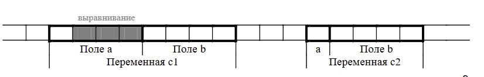

# Лекция №5. Структуры и объединения

## Структуры

**Структура** представляет собой одну или несколько
переменных (возможно разного типа), которые
объединены под одним именем.

```C
struct <имя> // Тег структуры
{
    // Поле структуры
    <тип_1> <имя_1>;
    <тип_2> <имя_2>;
    ...
    <тип_N> <имя_N>;
};
```


*Описания структур располагаются в заголовочных файлах*

### Способы определения переменных структурного типа

#### Раздельные определения типа и переменных

```c
struct date
{
    int day;
    int month;
    int year;
};

struct date birthday;
struct date exam;
```

#### Cовмещенные определения типа и переменных
```C
struct date
{
    int day;
    int month;
    int year;
} birthday, exam;
```

## Поля структуры
### Расположение в памяти


```c
struct a
{
    char a;
    int b;;
} s
```

s:

| byte 0 | byte 1   | byte 2   | byte 3   | 
|:------:|:------:|:------:|:------:|
| a      | padding  | padding  | padding  |

byte 4 | byte 5 | byte 6 | byte 7 |
|:--------:|:-------:|:--------:|:------:|
| b      | b      | b      | b      |



1. Поля структуры располагаются в памяти в порядке
описания.
2. С целью оптимизации доступа компилятор может
располагать поля в памяти не одно за другим, а по
адресам кратным, например, размеру поля.
3. Адрес первого поля совпадает с адресом переменной
структурного типа.
4. Поля структуры могут иметь любой тип, кроме типа
этой же структуры, но могут быть указателями на него

`#pragma pack(push, 1)` - удаляет текущее выравнивание, устанавливая новое

`#pragma pack(pop)` - установить старое выравнивание

## Инициализация

```C
struct date
{
int day;
int month;
int year;
};

#define NAME_LEN 15

struct person
{
char name[NAME_LEN+1];
struct date birth;
};

int main(void)
{
    struct date today = {23, 4, 2025};
    struct date day = {17};
    struct date year = {, , 2025}; // error: expected expression before ',' token
    
    
    struct person rector =
        {"Gordin", {16, 8, 1969}};
    struct date holidays[] =
    {
        { 8, 5, 2025},
        { 9, 5, 2025},
        {10, 5, 2025},
        {11, 5, 2025}
    };
```

```C
struct date exam =
    {.day = 13, .month = 1, .year = 2019};
```

## Операции над  структурами

### Доступ к полю

структура.<имя>

```C
today.day
(*today_pointer).day
today_pointer->day // Для указателя

some_date = today // полностью
if (some_date == today) // НЕЛЬЗЯ
```

*круто передавать указатели, а не сами структуры!!11!*

## Объединения 

**Объединение**, как и структура, содержит одно или
несколько полей возможно разного типа. Однако все поля
объединения разделяют одну и ту же область памяти.


## Инициализация

Присвоение значения одному члену объединения
обычно изменит значение других членов.

```c
union u_t
{
    int i;
    double d;
};
...
union u_t u_1 = {1};

// только c99
union u_t u_2 = { .d = 5.25 };
```


## Выравнивание данных

Переменные располагаются по
адресу, кратному их размеру.